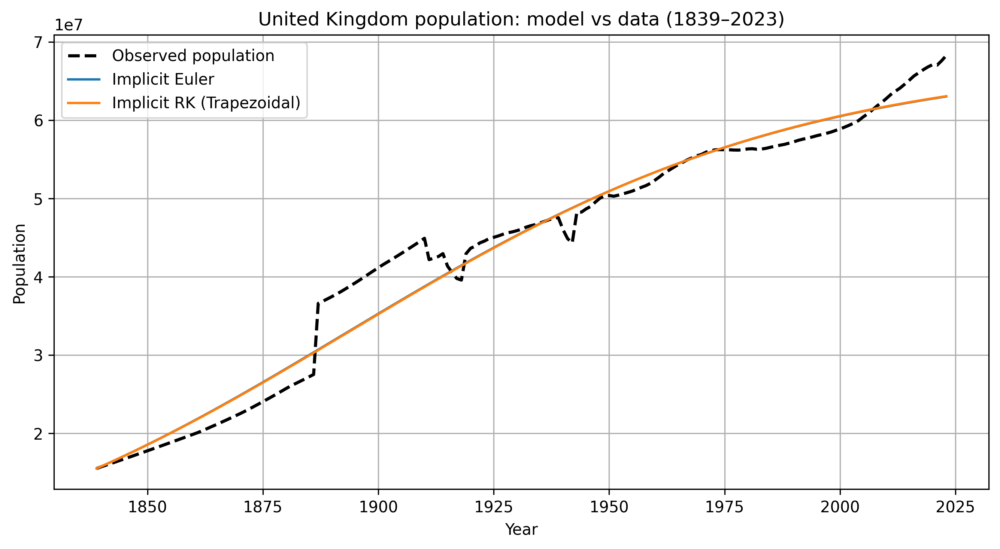
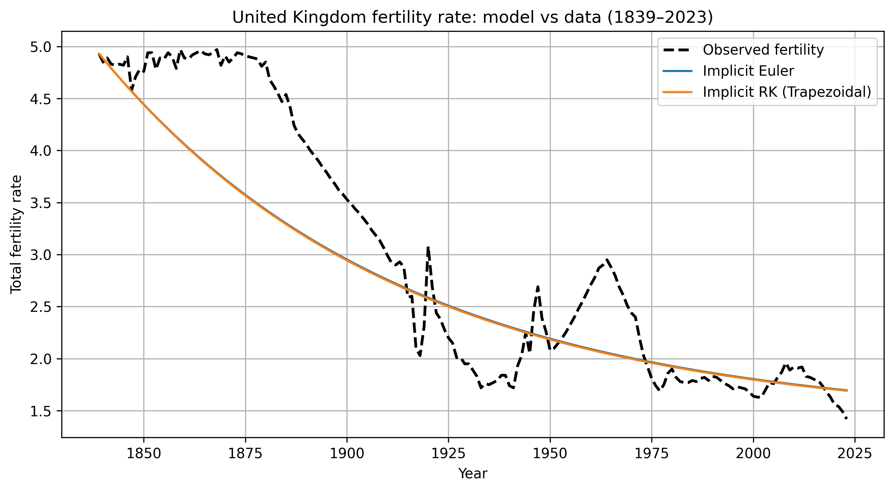
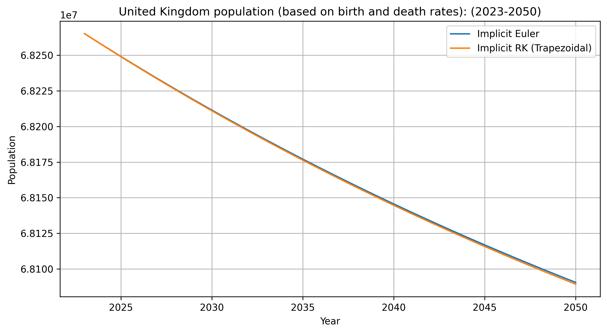
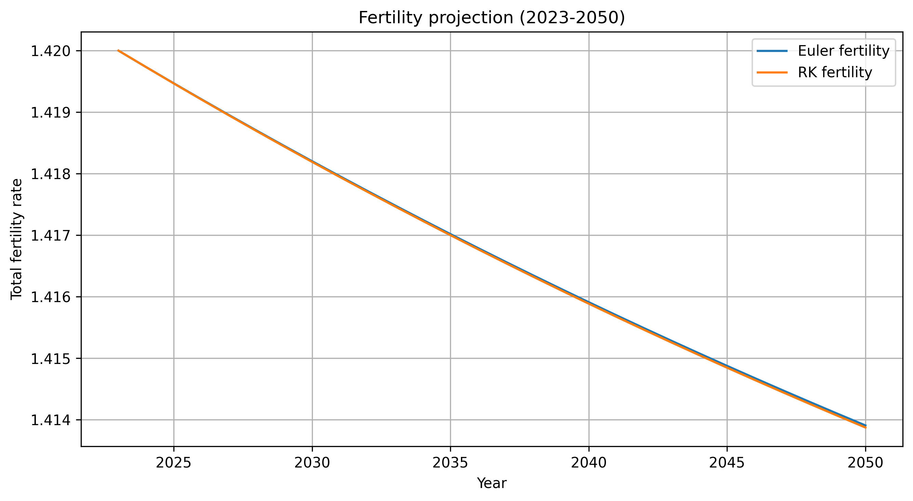

# Population–Fertility Dynamics: Implicit Euler vs Trapezoidal Rule

## Table of Contents

* [Project Overview](#project-overview)
* [Model Description](#model-description)
* [Numerical Methods](#numerical-methods)
* [Parameter Calibration](#parameter-calibration)
* [Experiments and Comparisons](#experiments-and-comparisons)
* [Results and Visualizations](#results-and-visualizations)
* [Project Structure](#project-structure)
* [How to Run](#how-to-run)
* [Key Conclusions](#key-conclusions)

---

## Project Overview

This project studies the numerical solution of a population–fertility ordinary differential equation (ODE) model calibrated using historical United Kingdom demographic data (1839–2023).

The primary goal is to **compare two implicit time-integration methods**:

* **Implicit Euler method** (first-order)
* **Trapezoidal rule** (second-order implicit Runge–Kutta)

Population projection is used as an application to evaluate numerical stability, accuracy, and long-term behavior.

---

## Model Description

The model couples population size (N(t)) and fertility rate (F(t)):

* Population growth is governed by births, deaths, and migration
* Fertility evolves according to a relaxation process toward a long-run equilibrium

The system has the form:

* ( N = b(F) * N * (1 - N/K) - d*N + m*N )
* ( F = -k (F - F_inf )

All parameters are assumed constant over time in the baseline model.

---

## Numerical Methods

Two implicit time-integration schemes are implemented and compared:

* **Implicit Euler method**

  * First-order accurate
  * A-stable
  * More numerically diffusive

* **Trapezoidal rule**

  * Second-order accurate
  * A-stable
  * Less numerical diffusion

At each time step, the resulting nonlinear system is solved using **Newton's method**.

---

## Parameter Calibration

Model parameters are estimated using **nonlinear least squares** over the full historical dataset.

Calibration minimizes the residuals between model predictions and observed data for:

* Population size
* Fertility rate

Residuals are defined as relative differences between model outputs and observations and are stacked into a single vector for optimization.

Once calibrated, parameters remain fixed for all subsequent simulations.

---

## Experiments and Comparisons

The following numerical experiments are performed:

1. Calibration of model parameters using historical data
2. Trajectory comparison between Implicit Euler and Trapezoidal methods
3. Residual analysis to assess model–data mismatch
4. Long-term population projection beyond observed data

Euler and Trapezoidal methods are always applied to the **same calibrated model**, ensuring a fair numerical comparison.

---

## Results and Visualizations

### Population: model vs data (1839–2023)



This figure compares observed United Kingdom population data with model
trajectories obtained using the implicit Euler method and the trapezoidal rule.

---

### Fertility: model vs data (1839–2023)



The fertility dynamics show a smooth relaxation toward the long-run equilibrium
fertility assumed in the model.

---

### Population projection (2023–2050)



Long-term population projections obtained using calibrated parameters.
Implicit Euler and trapezoidal methods produce nearly identical trajectories.

---

### Fertility projection (2023–2050)



Projected fertility converges toward the assumed long-run level (F_inf).

---

### Calibrated Data
| Parameter | Description                    | Value      |
| ------- | ------------------------------ |------------|
| (b_0)   | Birth-rate coefficient         | 0.023931   |
| (alpha) | Fertility elasticity           | 0.0857     |
| (d)     | Death rate (1/year)            | 0.019310   |
| (m)     | Migration rate (per 1000/year) | 0.013399   |
| (K)     | Carrying capacity              | 8.922e+07  |
| (k)     | Fertility relaxation rate      | 0.013555   |
| (F_inf) | Long-run fertility             | 1.40       |

---

### Final State Comparison: Euler VS Trapezoidal
| Method              | (N(2023))  | (F(2023)) |
| ------------------- | ---------- | --------- |
| Implicit Euler      | 63,027,054 | 1.6964    |
| Trapezoidal         | 63,064,710 | 1.6915    |
| Absolute difference | 37,656     | 0.0049    |

___

### RMSE (Root Mean Square Error) Comparison
| Method         | Population RMSE | Fertility RMSE |
| -------------- | --------------- |----------------|
| Implicit Euler | 7.1119e-02      | 1.7168e-01     |
| Trapezoidal    | 7.1083e-02      | 1.7165e-01     |

RMSE (root mean square error) quantifies the average relative deviation between model predictions and observed data over the entire simulation period.
Euler and Trapezoidal have essentially identical accuracy relative to data.
---

## Project Structure

```
src/
├── model.py              # ODE model definition
├── parameters.py         # Model parameter container
├── ivp.py                # Initial value problem definition
├── simulation.py         # Time-stepping logic
│── calibrator.py
├── methods/
│   ├── implicit_euler.py
│   └── implicit_trapezoidal.py
├── solvers/
│   └── newton.py
├── visualizations.py     # Plotting utilities
│   └── visualization.py
│   └── ProjectVisualizations.py
│   └── plots
└── main.py               # Experiment orchestration
```

---

## How to Run

Run the main experiment pipeline with:

```bash
python main.py
```

---

## Key Conclusions

* Both implicit Euler and trapezoidal methods are stable and accurate for this problem
* At yearly resolution, numerical discretization error is negligible
* Long-term dynamics are dominated by model assumptions rather than solver choice
* Population projection serves as an effective test case for numerical method comparison

---
